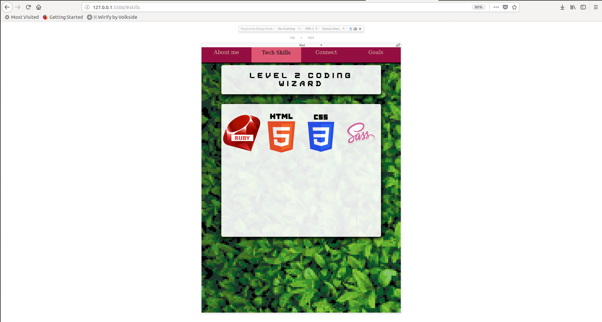

# Portfolio Site
Link to live wesite - https://danbytes.github.io
Link to github repo - https://github.com/DanBytes/portfolio

## Part A

### Purpose
The purpose of my portfolio website is to introduce myself to the world and potential employers.

### Functionality and Features
My portfolio has 4 main sections that inform the visitor about me.
- About Me (Some general information about me.)
- Skills (Showing coding languages I'm comfortable with so far.)
- Connect (Ways to get in touch with me, links to my Linkedin, Github, Twitter profile.)
- Goals (Future plans,)

I have 5 main (I find) cool elements incorporated into my portfolio:
- The globe has a spinning effect and lots of box-shadows to make it look more organic.
- Navigation bar is fixed fo that the user never loses it when scrolling.
- Each section has a different background to destinguish itself from others.
- The backgrounds are sort of paralax.
- When user interacts with the navigation bar it will scroll them to the desired section,

### Site Map
index.html (single page web site)

### Website Screen Shots

#### Desktop

#### Tablet

#### Mobile

### Target Audience
Industry recruiters, software companies.

### Tech Stack
- HTML
- CSS
- SCSS

### Design Planning
In the brain storming phase I was thinking for the themes for the site. I also wanted to create a
clean and colourful pixel art porfolio that displays my personality and creativity.
The themes are "dicovery"  and "introduction" as indicated by opening title "hello world"  and a spinning globe.
### Initial Wireframes
Those designs were dropped due to the complexity.

### New Wireframes
Much easier design

#### Mood Board Inspiration

#### Initial Idea
Initially I had an idea to have a rocket ship as a fixed navigation menu to the side. The ship is "landing" or "ascending" on the web page as the 
user is crolling. However I had to scrap that idea because I coulndt make the rocket s 
I could not make the ship look desent and I figured out that it would be a tough work in long run.

#### Accessibility
This is would be revised in future iteration of the site. Color Oracle seems like an exellent software to test colours for blind people.

### Technologies Used
- Visual Studio Code
- GitHub
- Ubuntu Terminal
- Adobe Color CC
- Canva
- Moodzer
- Firefox Developer Tools

### Bugs
- The intro screen is broken on mobile devices in landscape mode. (Will try to fix that in next iteration)

### Future updates.
- Accesability for color blind people.
- Fix alighnment of the content in portrait modes.
- Improve content on the site.
- Instead of using "scroll-behavior: smooth;" in css (which isn't compatible with many browsers) use javascript for 
    smooth scrolling to reach greater comatiblity.
##Part B
### 1.Describe key events in the development of the internet from the 1980s to today.
TImeline:

1981 - The TCP/IP standards were published and adapted.
1983, TCP/IP protocols became the only approved protocol on the ARPANET (The Advanced Research Projects Agency Network). This was the first form of internet used by scientists.
1989 - The web was originally conceived and developed to meet the demand for automatic information-sharing between scientists in universities and institutes around the world.
1990 - ARPANET was starting to show the age and the project was closed down.
1991 -  World Wide Web become accessible to anyone with internet connection.
1992 - The first ever browser was created with GUI named Erwise.
1992 - Dial Up was first commercially offered by Sprint.
1994 - Netscape navigator was created and it was the most popular browser then.
1998 - Google was created.
2004 - Facebook was created.
2005 - YouTube was invented.
 

### 2.Define and describes the relationship between fundamental aspects of the internet such as: domains, web servers, DNS, and web browsers.

#### Domain. (Identifier)
Domain is a unique identifier for IP address. Instead of writing I.P address (e.g 193.212.204.123) we use memorable words instead (e.g google.com). Domain acts much like a phone number.

#### DNS (Matching System)
Domain Name System (DNS) - in a nutshell, it is a client-server communication system. Clients on the network send requests and they receive the responses. Think of it as a phone book that matches phone numbers (domains) to services on receiving end .

#### Web Servers (Matched service with the client)
Web servers are programs that deliver content to the end user over the internet.

#### Web Browsers (Clients)
Browsers are basically clients (end users) on the network. They request data from the web servers and interpret the requests on users machines.  

### 3.Reflect on one aspect of the development of internet technologies and how it has contributed to the world today

While I was researching the information it came to my attention that the internet advanced rapidly and still is. Especially in the 90’s when it became publicly available, it became part of our lives nowadays, even an necessity. Many useful services live on the internet.
