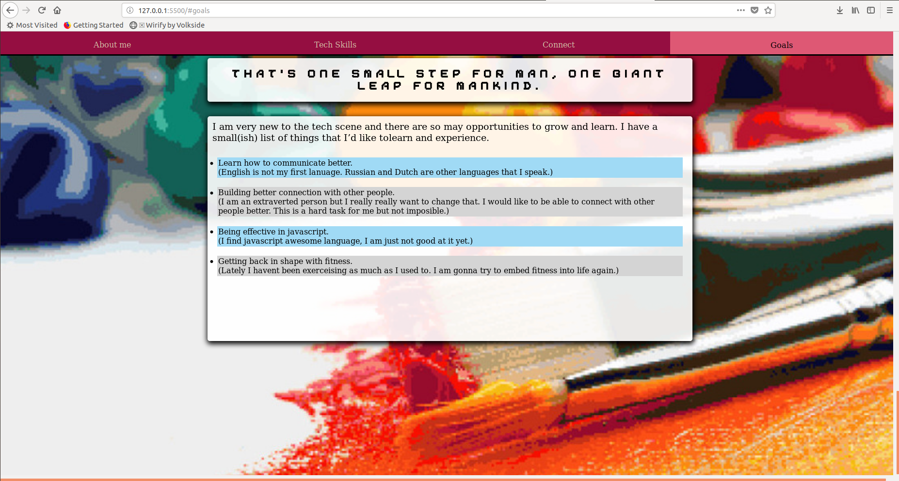

# Portfolio Site

Link to github repo - https://github.com/DanBytes/portfolio

## Part One

### Purpose
The purpose of my portfolio website is to introduce myself to the world and potential employers.

### Functionality and Features
My portfolio has 4 main sections that inform the visitor about me.
- About Me (Some general information about me.)
- Skills (Showing coding languages I'm comfortable with so far.)
- Connect (Ways to get in touch with me, links to my Linkedin, Github, Twitter profile.)
- Goals (Future plans,)

I have 5 main (I find) cool elements incorporated into my portfolio:
- The globe has a spinning effect and lots of box-shadows to make it look more organic.
- Navigation bar is fixed fo that the user never loses it when scrolling.
- Each section has a different background to destinguish itself from others.
- The backgrounds are sort of paralax.
- When user interacts with the navigation bar it will scroll them to the desired section,

### Site Map
index.html (single page web site)

### Website Screen Shots

#### Desktop

#### Tablet

#### Mobile

### Target Audience
Industry recruiters, software companies.

### Tech Stack
- HTML
- CSS
- SCSS

### Design Planning
In the brain storming phase I was thinking for the themes for the site. I also wanted to create a
clean and colourful pixel art porfolio that displays my personality and creativity.
The themes are "dicovery"  and "introduction" as indicated by opening title "hello world"  and a spinning globe.

#### Mood Board Inspiration

#### Initial Idea
Initially I had an idea to have a rocket ship as a fixed navigation menu to the side. The ship is "landing" or "ascending" on the web page as the 
user is crolling. However I had to scrap that idea because I coulndt make the rocket s 
I could not make the ship look desent and I figured out that it would be a tough work in long run.

#### Accessibility
This is would be revised in future iteration of the site. Color Oracle seems like an exellent software to test colours for blind people.

### Technologies Used
- Visual Studio Code
- GitHub
- Ubuntu Terminal
- Adobe Color CC
- Canva
- Moodzer
- Firefox Developer Tools

### Bugs
- The intro screen is broken on mobile devices in landscape mode. (Will try to fix that in next iteration)

### Future updates.
- Accesability for color blind people.
- Fix alighnment of the content in portrait modes.
- Improve content on the site.
- Instead of using "scroll-behavior: smooth;" in css (which isn't compatible with many browsers) use javascript for 
    smooth scrolling to reach greater comatiblity.
